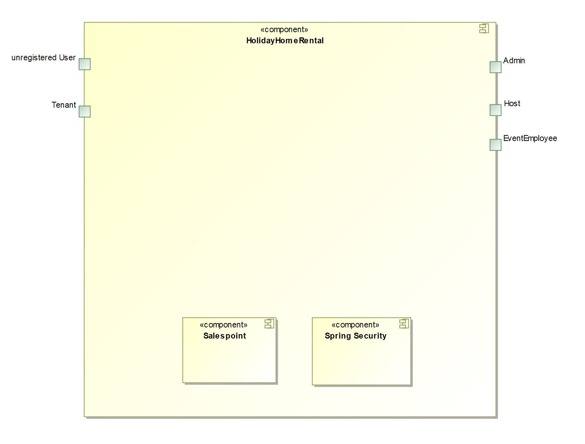
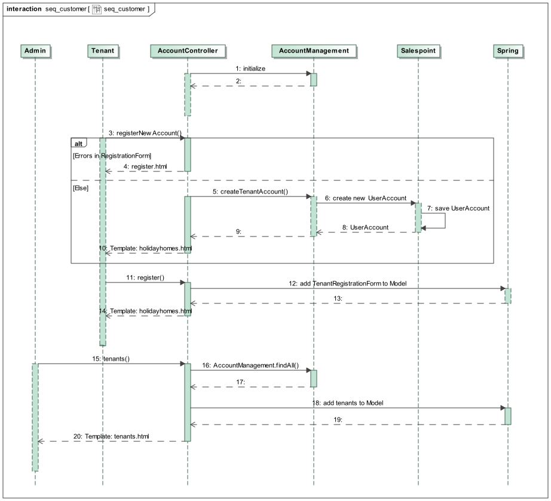

:project_name: FeWoDre
= Entwicklerdokumentation __{project_name}__
:toc: macro
:numbered:
:toc-title: Inhaltverzeichnis

[options="header"]
[cols="1, 3, 3"]
|===
|Version | Bearbeitungsdatum   | Autor 
|...	| ... | ...
|===
toc::[]

== Einführung und Ziele
=== Aufgabenstellung
Urlaub im eigenen Land liegt im Trend. Und auch Sachsen, im Besonderen Dresden und dessen Umland, profitieren davon. Leider war es jedoch bisher sehr mühsam, als Urlaubs-williger Tourist ein geeignetes Ferienhaus zu finden. Bisher. Denn genau diese eklatante Lücke wird nun durch FeWoDre (FerienWohnungenDresden) geschlossen. Und nicht nur das, darüber hinaus bietet es auch noch die Möglichkeit, eine abwechslungsreiche Freizeitgestaltung gleich mit dazu buchen zu können.

Unsere Website (FeWoDre) ermöglicht es einer beliebigen Anzahl an Vermietern (Host), eine gleichsam beliebige Anzahl an Ferienwohnungen (HolidayHome) zur Vermietung anzubieten. Diese können dann von einem (potenziellen) Mieter (Tenant) angesehen und gegebenenfalls gebucht (Booking) werden, sollte die Verfügbarkeit (BookingStatus) dies zulassen. In Abhängigkeit von der Lage (Place) der Ferienwohnung werden dem Mieter nun, so vorhanden, kleinere Veranstaltungen (SmallEvent) angezeigt, welche regelmäßig stattfinden (EventStatus) und ohne Aufpreis besuchbar sind. Neben diesen kleineren Veranstaltungen gibt es jedoch auch noch große (LargeEvent), welche aus Planungs- und Kapazitätsgründen einer vorherigen Anmeldung bedürfen (EventStatus) und auch nicht mehr (zwingend) kostenlos sind. Diese Veranstaltungen werden in enger Zusammenarbeit von einer in Dresden ansässigen Eventfirma (EventCompany) ausgerichtet und durch deren Mitarbeiter (EventEmployee) betreut. Wie viele Veranstaltungen ein Mieter während seines Aufenthalts besuchen möchte, ist allein ihm und seinen zeitlichen sowie finanziellen Möglichkeiten überlassen.

Hauptverantwortlich für einen reibungslosen Ablauf, im Besonderen für die Integrität der Website, ist der Administrator (Admin), welcher die Vermieter, Eventfirmen und deren Mitarbeiter erstellt und löscht sowie die Mieter freischaltet oder gegebenenfalls löscht.

=== Qualitätsanforderungen
Um die Qualität des Programms empirisch bewertbar zu machen bedarf es der Definition von Qualitätsanforderungen, welche es zu erfüllen gibt.

Wartbarkeit::
Hierbei wird bestimmt wie effektiv und effizient es möglich ist die Software zu modifizieren, mit dem Ziel diese zu verbessern, zu korrigieren oder an geänderte
Umgebungsverhältnisse anzupassen.

Nutzbarkeit::
Maß, inwieweit die Software von einem konkreten Benutzer zum Erreichen konkreter Ziele verwendet werden kann, unter Berücksichtigung von Effektivität, Effizienz und Zufriedenstellung in der konkreten Situation.

Sicherheit::
Maß, inwieweit Daten und Informationen durch das System geschützt werden, im Besonderen, dass allen entsprechenden (humanen und technischen) Komponenten stets nur die ihm/ihr zustehenden Daten und Informationen zugänglich gemacht werden.

Nachfolgende Tabelle gibt die zu erfüllenden Qualitätsanforderungen sowie deren Wichtigkeit an.

1 = nicht wichtig ..
5 = sehr wichtig
[options="header", cols="3h, ^1, ^1, ^1, ^1, ^1"]
|===
|Qualitätsanforderung       | 1 | 2 | 3 | 4 | 5
|Wartbarkeit                |   |   |   | x |
|Nutzbarkeit                |   |   |   |   | x
|Sicherheit                 |   |   |   | x |
|===

== Randbedingungen
=== Hardware-Vorgaben
Eine Liste notwendiger Geräte / Hardware, um die Anwendung auszuführen.

* Server
* (mobiles) Endgerät (Computer / Handy / Tablet etc.)
* Eingabegerät ( Tastatur / Touch etc.)
* Maus / Touch

=== Software-Vorgaben
Eine Liste notwendiger Software, um die Anwendung auszuführen.
Die folgende Javaversion ist mindestens erforderlich, um die Anwendung auszuführen:

* Java 11

Die folgenden Versionen der Browser sind jeweils mindestens erforderlich, um die Anwendung auszuführen:

* Internet Explorer / Edge 10.0
* Firefox 4.0
* Google Chrome 4.0
* Opera 9.6

=== Vorgaben zum Betrieb des Software
Im Folgenden wird ein Überblick darüber gegeben wie und unter welchen Umständen die Verwendung der fertigen Software intendiert ist.

Das System wird als Onlineshop durch die Firma FeWoDre GmbH zur Vermietung ihrer Ferienhäuser sowie damit assoziierter Veranstaltungen verwendet. Hierzu wird die Software auf einem Server laufen und global mithilfe eines Browsers durch das Internet für interessierte Kunden 24/7 auf- und abrufbar sein.

Die primäre Zielgruppe sind Personen zwischen 18 und 80 Jahren (Tenants), deren Wissen über das Internet dahingehen ausreichte, dass sie es bis auf unsere Website geschafft haben. Ab da soll es dank einer intuitiven Benutzeroberfläche problemlos bis zum Abschluss eines Kaufs weitergehen können. Ferner gibt es Vermieter (Hosts), welche über geringfügig tiefere technische Kenntnisse verfügen müssen, etwa, um Bilder ihrer Ferienwohnung(en) hochzuladen sowie Angestellte einer Eventfirma (EventEmployee), für die selbige Anforderungen gelten. Abschließend gibt es noch einen Administrator, welcher wiederum leicht höherer technische Anforderungen erfüllen muss als die bisherigen Gruppen, um sicherzustellen, dass er nicht versehentlich alle Konten löscht.

Es ist nicht angedacht, dass das System regelmäßiger Wartung bedarf. Alle Daten werden in einer Datenbank persistiert und können durch die Anwendung aufgerufen werden, sodass keine Kenntnisse im Umgang mit Datenbanken von irgendeiner der zuvor genannten Entitäten erwartet werden müssen.

== Kontextabgrenzung

== Lösungsstrategie
=== Erfüllung der Qualitätsziele
[options="header"]
|===
|Qualitätsanforderung |Lösungsansatz
|Wartbarkeit a|
* *Modularität* Die Anwendung wird aus klar abgegrenzten Einzelbausteinen zusammengesetzt, womit Änderungen in einem Block minimale Auswirkungen auf die anderen Blöcke haben.
* *Wiederverwertbarkeit* Es wird sichergestellt, dass Komponenten des Systems an anderer Stelle und durch andere Komponenten oder Systeme wiederverwendet werden können.
* *Modifizierbarkeit* Es wird sichergestellt, dass die Anwendung modifiziert und erweitert werden kann, ohne, dass dies zu Fehlern oder einer sonstigen Minderung der Qualität des Produktes führt.
|Nutzbarkeit a|
* *Erlernbarkeit* Es wird sichergestellt, dass das Systeme einfach und intuitiv durch den Nutzer erlern- und bedienbar ist. Dies wird etwa durch geeignete Hinweise bei Eingabefeldern realisiert
* *Verhinderung / Umgang mit Fehlern durch den Benutzer* Benutzer sollten davor bewahrt werden, fehlerhafte Eingaben zu tätigen, etwa durch geeignete Hinweise. In keinem Fall sollten solche Fehler jedoch zu einem invaliden Systemzustand führen.
* *Ansprechende Benutzeroberfläche* Dies wird durch das Engagement des renommierten Designers Janujan Thanabalasingham sichergestellt, welcher sich um die ansprechende Gestaltung der Benutzeroberfläche kümmert.
* *Barrierefreiheit* Es wird sichergestellt, dass eine möglichst große Spanne an unterschiedlichen Personen die Website nutzen kann, etwa durch entsprechende Schriftarten oder ausreichenden Kontrast.
|Sicherheit a|
* *Vertraulichkeit* Es wird sichergestellt, dass Daten nur bei entsprechender Autorisierung eingesehen werden können, etwa durch _Spring Security_ und _Thymeleaf_('sec:authorize')
* *Integrität* Daten werden gegen unautorisierte Manipulation geschützt, etwa durch _Spring Security_ ('@PreAuthorize')
* *Zuordenbarkeit* Nachverfolgbarkeit von Handlungen und Ereignissen zu einer konkreten Entität oder Person. Hierzu sollte etwa jede 'Order' mit einem 'Customer' verknüpft sein.
|===

=== Softwarearchitektur

image:models/design/Top-Level-Architektur.png[Top-Level-Architektur der Anwendung]

_Top Level Architekur der Anwendung_

_Softwarearchitektur als Client-Server-Diagramm_

=== Entwurfsentscheidungen

==== Entwurfsmuster
* Spring MVC

==== Persistenz
Die Anwendung verwendet *Hibernate annotationsbasiertes Mapping* um Java-Klassen und Datenbanktabellen zu verknüpfen. Dabei verwenden wir *H2* als grundlegende Datenbanktechnologie. Standardgemäß ist die Persistenzfunktion deaktiviert. Um dies zu ändern, müssen folgende zwei Zeilen in der Datei _application.properties_ entkommentiert werden: 
....
# spring.datasource.url=jdbc:h2:./db/videoshop
# spring.jpa.hibernate.ddl-auto=update
....

==== Benutzeroberfläche
image:models/design/user_interface_dev_doc.svg[Dialog-Karte]

=== Verwendung externer Frameworks

[options="header", cols="1,2"]
|===
|Externes Package |Verwendet von (Klasse der eigenen Anwendung)
|salespointframework.catalog a|
* bookings.BookingEntity
* bookings.BookingManagement
* catalog.HolidayHomeCatalog
* catalog.EventCatalog
* catalog.Event
* catalog.EventCatalog
* catalog.HolidayHomeCatalog
|salespointframework.inventory a|
* bookings.BookingManagement
|salespointframework.order a|
* bookings.BookingEntity
* bookings.CartController
* bookings.BookingManagement
|salespointframework.payment a|
* bookings.BookingEntity
* bookings.BookingManagement
|salespointframework.quantity a|
* bookings.BookingEntity
* bookings.CartController
* bookings.BookingManagement
* catalog.CatalogController
|salespointframework.useraccount a|
* bookings.BookingEntity
* bookings.CartController
|springframework.beans a|
* bookings.BookingManagement
|springframework.data a|
* bookings.BookingRepository
* bookings.BookingManagement
* catalog.HolidayHomeCatalog
* catalog.EventCatalog
|salespointframework.core a|
* catalog.CatalogDataInitializer
|salespointframework.time a|
* catalog.CatalogController
|springframework.format a|
* bookings.BookingEntity
* bookings.CartController
|springframework.security a|
* bookings.CartController
|springframework.stereotype a|
* bookings.CartController
* bookings.BookingManagement
* catalog.catalogDataInitializer
|springframework.transaction a|
* bookings.BookingManagement
|springframework.ui a|
* bookings.CartController
* catalog.catalogcontroller
|springframework.util a|
* bookings.BookingManagement
* bookings.BookingManagement
|springframework.web a|
* bookings.CartController
* catalog.catalogController
|javax.persistence.Entity a|
* catalog.Event
* catalog.HolidayHome
|javamoney.moneta.Money a|
* catalog.Event
* catalog.HolidayHome
* catalog.EventForm
* catalog.HolidayHomeForm
* catalog.CatalogDataInitializer
| slf4j.Logger a|
* bookings.CartController
* catalog.catalogDataInitializer
|slf4j.LoggerFactory a|
* bookings.CartController
* catalog.catalogDataInitializer
|
|===

== Bausteinsicht
* Entwurfsklassendiagramme der einzelnen Packages

=== Accounts

image:models/design/useraccounts.svg[Entwurfs-Klasse-Diagramm - Booking]

[options="header"]
|=== 
|Klasse/Enumeration |Beschreibung
|AccountController|Ein Spring MVC Controller um die Nutzeraccounts zu verwalten.
|AccountDataInitializer|Ein Salespoint DataInitializer, der zur Bereitstellung von (Test-)Accounts dient. 
|AccountEntity|Eine Spring Entity welche die verschiedenen Nutzeraccounts der Platform darstellt. Sie trägt unter anderem ein UserAccount des Salespoint-Frameworks als Attribut.
|AccountManagement|Ein Spring-Service, der die Erstellung und Verwaltung von Nutzeraccounts/AccountEntities der Platform als Aufgabe hat.
|AccountRepository|Eine Schnittstelle, die das CrudRepository von Spring erweitert und Methoden zur Abfrage von Nutzeraccounts bereitstellt.
|EventEmployeeRegistrationForm|Diese Klasse dient zur Übermittlung und Validierung des Formulars, welches ausgefüllt wird, um einen Eventmitarbeiter-Account zu erstellen.
|HostRegistrationForm|Diese Klasse dient zur Übermittlung und Validierung des Formulars, welches ausgefüllt wird, um einen Vermieter-Account zu erstellen.
|TenantRegistrationForm|Diese Klasse dient zur Übermittlung und Validierung des Formulars, welches ausgefüllt wird, um einen Mieter-Account zu erstellen.
|===

=== Order

image:models/design/Order.svg[Entwurfs-Klasse-Diagramm - Booking]

[options="header"]
|=== 
|Klasse/Enumeration |Beschreibung
|CartController|Ein Spring MVC Controller um den Einkaufswagen/Buchungen zu Steuern
|BookingEntity|Eine Spring Entity welche die Salespoint Order Erweitert und im Booking-Repository abgespeichert wird
|BookingManagement|Eine Komponente welche eingegebene Daten für BookingEntities auf korrektheit überprüft und diese dann im Repository abspeichert
|===

=== Catalog

image:models/design/catalog.svg[Entwurfs-Klassen-Diagramm - Catalog]

[options="header"]
|=== 
|Klasse/Enumeration | Beschreibung
|CatalogController| Ein Spring Controller um den EventCatalog und den HolidayHomeCatalog zu steuern.
|CatalogDataInitializer | Einen Salespoint DataInitializer, der zur Bereitstellung grundsätzliche (Test-)Daten dient. 
|HolidayHome | Stellt ein Ferienhaus dar.
|HolidayHomeCatalog| Dient zur verwaltung der Ferienhäuser
|HolidayHomeForm| Dient zum erstellen eines Ferienhauses
|Event| Stellt ein Event dar.
|eventForm| Dient zum erstellen eines Events
|EventCatalog| Dient zum erstellen von Events
|EventType| Diese Enumeration beschreibt den Typ des Events
|===

=== Rückverfolgbarkeit zwischen Analyse- und Entwurfsmodell
_Die folgende Tabelle zeigt die Rückverfolgbarkeit zwischen Entwurfs- und Analysemodell. Falls eine Klasse aus einem externen Framework im Entwurfsmodell eine Klasse des Analysemodells ersetzt,
wird die Art der Verwendung dieser externen Klasse in der Spalte *Art der Verwendung* mithilfe der folgenden Begriffe definiert:_

* Vererbung/Schnittstellen-Implementation
* Klassenattribute
* Methodenparameter

[options="header"]
|===
|Klasse/Enumeration (Analysemodell) |Klasse/Enumeration (Entwurfsmodell) |Art der Verwendung
|FeWoMi |fewodre.FeWoDre |
|UserAccount a|- salespointframework.useraccount
- useraccounts.AccountEnitity a|- Klassenattribute
- Methodenparameter
|Admin, Tenant, Host, EventEmployee a|- useraccounts.AccountEntity
- salespointframework.useraccount.Role a|- Die einzelnen Klassen der unterschiedlichen Nutzergruppen wurden zu einer Account-Klasse zusammengefasst. Sie unterscheiden sich durch unterschiedliche Rollen.
- Klassenattribute
|Booking a|- bookings.BookingEntity
- salespointframework.catalog
- salespointframework.order
- salespointframework.payment
- salespointframework.quantity
- salespointframework.useraccount a|- Klassenattribute
- Methodenparameter
|HolidayHome a|- catalog.holidayhomes
- salespointframework.catalog a| - Klassenattribute
- Methodenparameter
|Event (SmallEvent, LargeEvent) a|- catalog.holidayhomes
- salespointframework.catalog a| - Klassenattribute
- Methodenparameter
|Place (SmallEvent, LargeEvent) a|- utils.Place |
|HolidayHomeManager, EventManager a| - catalog.CatalogController
- salespointframework.inventory
- salespointframework.quantity
- salespointframework.time
a| - Klassenattribute
- Methodenparameter
|BookingManager a|- booking.BookingManagement
- booking.BookingController
- salespointframework.order
- salespointframework.quantity
- salenpoint.framework.payment
- salespointframework.useraccount a|- Vererbung/Schnittstellen-Implementation
- Methodenparameter
|AccountManager a|- useraccounts.AccountManagement
-useraccounts.AccountController
-salespointframework.useraccount a| - Klassenattribute
- Methodenparameter
|===

== Laufzeitsicht
* Darstellung der Komponenteninteraktion anhand eines Sequenzdiagramms, welches die relevantesten Interaktionen darstellt.

=== Catalog

=== Tenant

=== Booking/Order

== Technische Schulden
* Auflistung der nicht erreichten Quality Gates und der zugehörigen SonarQube Issues zum Zeitpunkt der Abgabe

