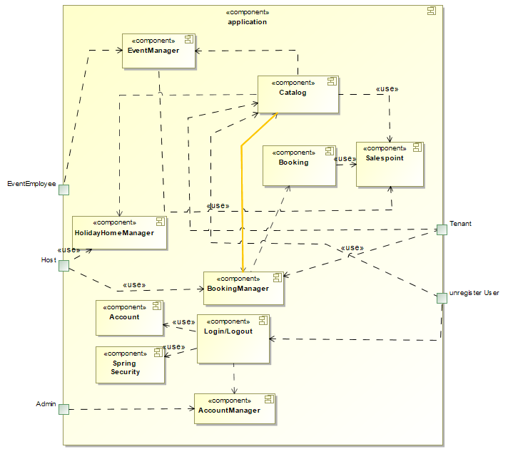
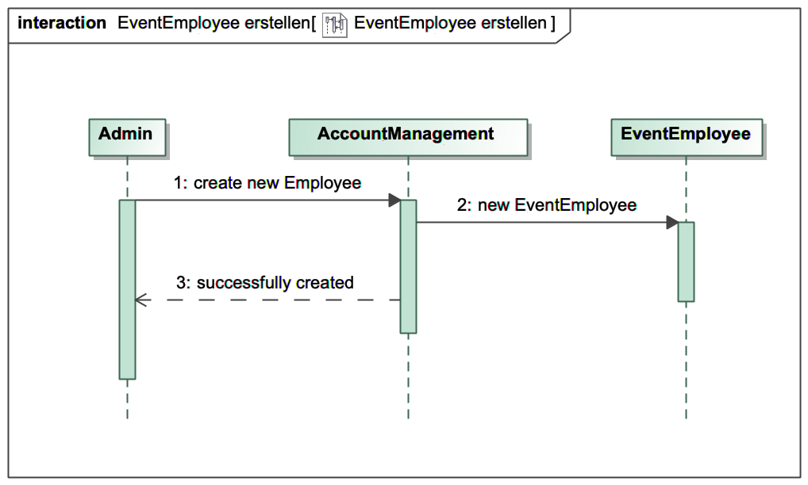
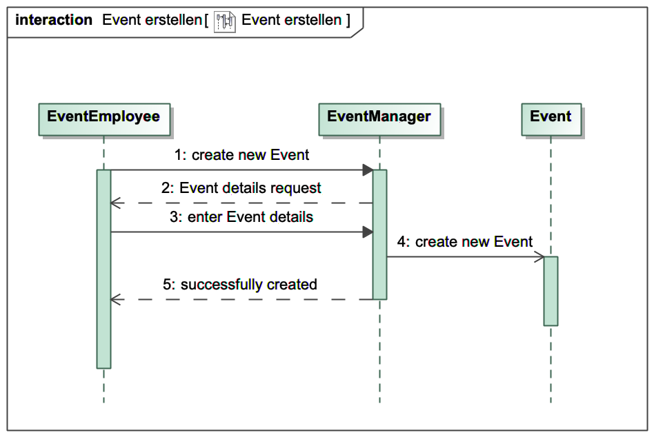
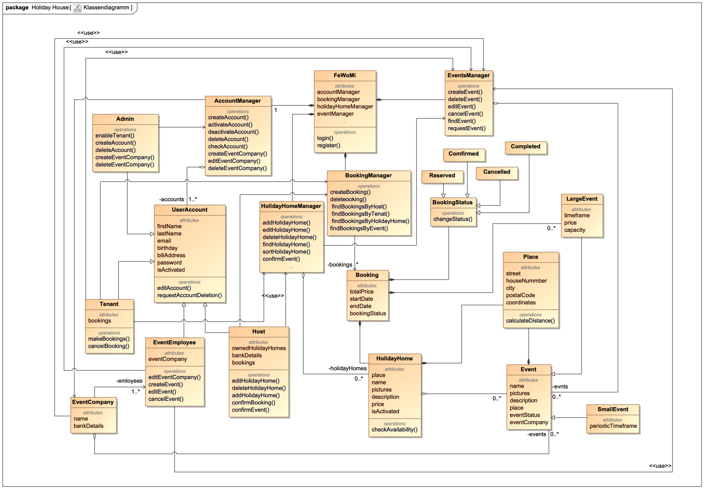

= Pflichtenheft
:project_name: FeWoDre
== __{project_name}__

[options="header"]
[cols="1, 1, 1, 1, 4"]
|===
|Version | Status      | Bearbeitungsdatum   | Autoren(en) |  Vermerk
|0.1     | In Arbeit   | 16.11.2020          | SWT-Gruppe 25     | Initiale Version
|===
:toc: macro
:toc-title:
== __{project_name}__
== Inhaltsverzeichnis
toc::[]
* 1. Zusammenfassung
* 2. Aufgabenstellung & Zielsetzung
* 3. Produktnutzung
* 4. Interessenvertreter (Stakeholders)
* 5. Systemgrenzen und Top-Level-Architektur
**  5.1 Kontextdiagramm
**  5.2 Top-Level-Architektur
* 6. Anwendungsfälle
**  6.1 Akteure
**  6.2 Überblick Anwendungsfalldiagramm
**  6.3 Anwendungsfallbeschreibungen
* 7. Funktionale Anforderungen
** 7.1 Muss-Kriterien
** 7.2 Kann-Kriterien
* 8. Qualitätsziele
* 9. GUI Prototyp
* 10. Dialoglandkarten
* 11. Datenmodell
** 11.1 Klassendiagramm
** 11.2 Klassen und Enumerationen
* 12. Akzeptanztestfälle
* 13. Glossar
 
== 1. Zusammenfassung
Dieses Dokument repräsentiert das Pflichtenheft des Projekts *FewoDre*. Ziel ist es, eine Übersicht über die zu entwerfende Software zu gewährleisten, welche als Grundlage für die Kommunikation zwischen den Interessenvertretern des Projekts und dem Entwicklerteam dient. Zielstellung ist es, dieses Dokument als Grundlage des Vertrags zwischen dem Auftraggeber und den Entwicklern anzunehmen, weshalb es hinsichtlich seiner Korrektheit und Konsistenz zu überprüfen ist. Folgendes Pflichtenheft beschreit die Anforderungen an das gewünschte System und, in Ansätzen, deren Implementierung durch die Entwickler.

Generell besteht der Anspruch, dass das Pflichtenheft *korrekt*, *komplett* und *konsistent* ist. Da dieses Pflichtenheft bei Abgabe als Maßstab für die Software dient, sollten sämtliche definierten Ziele *erfüllbar* sein. Eine *Rückfervolgung* ist wichtig, da das Pfilchtenheft während des gesamten Entwicklungsprozesses verwendet und als Referenz herangezogen wird. Ferner besteht der Anspruch der einfachen Erweiterbarkait, obgleich Änderungen nach Zustimmung durch die Interessenvertreter auf ein Minumum begrenzt werden sollten.  Da Anforderungen und Umstände konstanten Änderungen unterliegen, sind Anpassungen erwartbar und müssen entsprechend dokumentiert werden.

== 2. Aufgabenstellung & Zielsetzung
Urlaub im eigenen Land liegt im Trend. und auch Sachsen, im Besonderen Dresden und dessen Umland, profitieren davon. Leider war es jedoch bisher sehr mühsam, als urlaubswilliger Tourist ein geeignetes Ferienhaus zu finden. Bisher. Denn genau diese eklatante Lücke wird nun durch FeWoDre (FerienWOhnungenDresden) geschlossen. Und nicht nur das, darüberhinaus bietet es auch noch die Möglichkeit, eine abwechslungsreiche Freizeitgestaltung gleich mitdazu buchen zu können.

Unsere Website (FeWoDre) ermöglicht es einer beliebigen Anzahl an Vermietern (Host), eine gleichsam beliebige Anzahl an Ferienwohnungen (HolidayHome) zur Vermietung anzubieten. Diese können dann von einem (potentiellen) Mieter (Tenant) angesehen und gegebenenfalls gebucht (Booking) werden, sollte die Verfügbarkeit (BookingStatus) dies zulassen. 
In Abhängigkeit von der Lage (Place) der Ferienwohung werden dem Mieter nun, so vorhanden, kleinere Veranstaltungen (SmallEvent) angezeigt, welche regelmäßig stattfinden (EventStatus) und ohne Aufpreis besuchbar sind. Neben diesen kleineren Veranstaltungen gibt es jedoch auch noch große (LargeEvent), welche aus Planungs- und Kapazitätsgründen einer vorherigen Anmeldung bedürfen (EventStatus) und auch nicht mehr (zwingend) kostenlos sind. Diese Veranstaltungen werden in enger Zusammenarbeit von einer in Dresden ansässigen Eventfirma (EventCompany) ausgerichtet und durch deren Mitarbeiter (EventEmployee) betreut. Wie viele Veranstaltungen ein Mieter während seines Aufenthalts besuchen möchte, ist allein ihm und seinen zeitlichen sowie finanziellen Möglichkeiten überlassen.

Hauptverantwortlich für einen reibungslosen Ablauf, im Besonderen für die Integrität der Website, ist der Administrator (Admin), wecher die Vermieter, Eventfirmen und deren Mitarbeiter erstellt und löscht sowie die Mieter freischaltet oder gegebenenfalls löscht.

== 3. Produktnutzung
Dieser Abschnitt wird im Folgenden einen Überblick über die geplante Nutzung der Software und dessen Einbettung geben.

Ziel der Software ist es als Web-Shop Kunden der Firma FeWoDre das digitale Buchen von Ferienhäusern in und um Dresden zu ermöglichen. Auf einem Server gehostet soll der Web-Shop rund um die Uhr und unter Nutzung eines Webbrowsers über das Internet erreichbar sein.

Eine Optimierung für folgende Webbrowser steht im Vordergrund:

- Mozilla Firefox, version 55.0.3+
- Google Chrome, version 61.0.3163+

Eine einfache Bedienung des webshops sollte ohne vertieftes technisches Verständnis möglich sein, um eine möglichst breite Zielgruppe anzusprechen. Sämtliche Daten sollen in einer Datenbank persistiert werden und durch den Webshop abfragbar sein.

== 4. Interessenvertreter (Stakeholders)

Nachfolgend sind sämtliche juristische und natürliche Personen aufgelistet, welche mit der Software interagieren oder dessen Anforderungen beeinflussen. Ferner erfolgt eine Priorisierung der Akteure zusammen mit einer Beschreibung ihrer vorrangigen Ziele. Die Priorisierung erfolgt absteigend, wobei 1 als niedrigste und 5 als höchste Priorität zu verstehen ist.

|===
|*Name* |*Priorität* |*Beschreibung* |*Ziele*
|FeWoDre GmbH |5 |Der primäre Auftraggeber des Projekts. a| - möglichst viele Ferienwohnungen vermieten 
- dabei mögichst wenig eigenen (Wartungs-)Aufwand haben 
- aufgrund starker Kompetation intuitiv benutzbare und ansprechende Benutzeroberfläche darbieten
- mögichst nahtlose Integration der Veranstalltungsfirma
|Mieter |4 |Hauptsächlicher Nutzer der Plattform, mit dem Ziel, Umsatz zu erzeugen a|
- möglichst einfache und intuitive Bedienbarkeit
- schnelle Abwicklung des Mietens einer Ferienwohnung
- möglichst detaillierte und übersichtliche Informationen über anfallende Kosten und die gebuchte Wohnung
|Vermieter |3 |Bietet seine freien Ferienwohnungen über unsere Plattform zur Miete an a|
- möglichst einfache und intuitive Bedienbarkeit
- Übersicht über vergangene, aktuelle und anstehende Vermietungen der eigenen Ferienwohnung(en)
- Einfache Integration von Verstalltungen auf der Detailseite der jeweiligen Ferienwohnung
|Veranstalltungsmitarbeiter |3 |Erstellt und verwaltet Veranstalltungen für seine Firma, erhöht dadurch die Attraktivität der Ferienwohnungen und somit unserer Plattform a|
- intuitive Übersicht über seine Veranstalltungen und deren Bearbeitungsmöglichkeiten
|Administrator |2 |Erstellt und löscht Vermieter und Eventfirmen, schaltet Mieter frei und kann diese auch wieder löschen a|
- Überblick über alle Benutzer der Plattform
- datenschutzkonformer Umgang mit den ihm gegebenen Möglichkeiten
|Entwickler |2 |Sind für die Implementierung der Plattform, respektive deren spätere Wartung und Betreuung, zuständig a|
- einfach erweiterbare Anwendung
- geringer Wartungsaufwand
- gutes Debugging
- gut kommentierter und verständlicher Code
|===

== 5. Systemgrenzen und Top-Level-Architektur

=== 5.1 Kontextdiagramm

Das Kontextdiagramm beschreibt die Integration das geplante Systems. Berücksichtigt werden alle Nutzergruppen und deren Zugriff auf das System sowie jegliche Software Dritter, welche auf das System zugreift oder auf die durch unser System zugegriffen wird.

[[Top-Level-Architektur]]
image::./models/analysis/Toplevel.jpg[Top-Level-Architektur, 100%, 100%, pdfwidth=100%, title= "Top-Level-Architektur", align=center]

=== 5.2 Top-Level-Architektur

Die Top-Level-Architektur des Systems verdeutlicht das nachfolgende Diagramm:

[[top-level-architektur]]

== 6. Anwendungsfälle

Der folgende Abschnitt gewährt einen Überblick über die durch das System erwartbar zu handhabenden Anwendungsfälle. Die Anwendungsfälle beschreiben die Funktionalität, die das System besitzen muss sowie die involvierten Akteure, wobei die Beschreibung hauptsächlich aus Sicht des Klienten erfolgt. 

=== 6.1 Akteure

Akteure sind die Benutzer des Software-Systems oder Nachbarsysteme, welche darauf zugreifen. Die nachfolgende Tabelle listet alle Akteure der Software und deren Beschreibung auf. Lassen sich Akteure zu einer Gruppe zusammenfassen, wird diese _kurisv_ dargestellt.

[options="header"]
[cols="1,4"]
|===
|Name |Beschreibung
|unregisteredUser | Stellt einen nicht registrieten Besucher der Seite dar, der mit dem System interagiert.
|UserAccount | Stellt einen registrierten Account/Benutzer der Seite dar, der mit dem System interagiert.
|Tenant | Stellt einen Benutzer mit der Rolle "TENANT" dar. Dieser entspricht einem Mieter.
|Host | Stellt einen Benutzer mit der Rolle "HOST" dar. Dieser entspricht einem Vermieter.
|Admin | Stellt einen Benutzer mit der Rolle "ADMIN" dar. Dieser ist verantwortlich für die interne Verwaltung/Accountverwaltung.
|EventEmployee | Stellt einen Benutzer mit der Rolle "EVENTEMPLOYEE" dar. Dieser ist verantwortlich für die Verwaltung von Events, die zu seiner EventCompany gehören.
|===

=== 6.2 Überblick Anwendungsfalldiagramm
Anwendungsfall-Diagramm, das alle Anwendungsfälle und alle Akteure darstellt.

[[Anwendungsfall-Diagramm]]

=== 6.3 Anwendungsfallbeschreibungen
Dieser Unterabschnitt beschreibt die Anwendungsfälle.

[cols="1h, 3"]
[[UC0100]]
|===
|ID | **<<UC0100>>**
|Name | Login
|Beschreibung | UserAccount soll die Möglichkeit haben sich anzumelden, um die besondere Rechte ihres Accounts wahrzunehmen.
|Akteure | UserAccount
|Trigger | unregisteredUser drückt auf einloggen in der Navigation bar um mehr Funktionen zu erhalten
|Vorbedingung(en) | UserAccount ist registriert und noch nicht eingeloggt
|Nötige Schritte a| - 1. unregisteredUser drückt auf einloggen in der Navigation bar
- 2. unregisteredUser gibt seine Anmeldedaten ein
- 3. unregisteredUser  drückt auf “Log in”
|Erweiterung | ...
|benötigte Funktionen | [F0010]
|===

[[login]]

[cols="1h, 3"]
[[UC0110]]
|===
|ID | **<<UC0110>>**
|Name | Logout
|Beschreibung | UserAccount soll die Möglichkeit haben sich abzumelden, um die besonderen Rechte ihres Accounts abzugeben.
|Akteure | UserAccount
|Trigger | UserAccount will das Portal verlassen und drückt deswegen auf "logout"
|Vorbedingung(en) | UserAccount ist eingeloggt
|Nötige Schritte | UserAccount drückt auf “logout” in der Navigation bar 
|Erweiterung | ...
|benötigte Funktionen | [F0010]
|===

[[logout]]
image::./models/analysis/Sequenzdiagramm/Logout.png[Logout, 100%, 100%, pdfwidth=100%, title= "Sequence diagram: Logout", align=center]

[cols="1h, 3"]
[[UC0120]]
|===
|ID | **<<UC0120>>**
|Name | Registrierung
|Beschreibung | unregisteredUser soll die Möglichkeit haben sich als Mieter registrieren zu können.
|Akteure | unregisteredUserAccount
|Trigger | unregisteredUser will sich registrieren um Tenant zu werden und Häuser mieten zu können, indem er das Formular ausfüllt und sendet.
|Vorbedingung(en) | unregisteredUser hat noch keinen Account
|Nötige Schritte a| - 1. unregisteredUser drückt auf registieren in der Navigation bar
- 2. unregisteredUser gibt die geforderten Daten ein und akzeptiert die Bedingungen
- 3. unregisteredUser  drückt auf registieren
|Erweiterung | ...
|benötigte Funktionen | [F0020],[F0021]
|===

[[registierung]]

[cols="1h, 3"]
[[UC0130]]
|===
|ID | **<<UC0130>>**
|Name | UserAccount editieren
|Beschreibung | UserAccount soll die Möglichkeit haben sich seine Daten ändern zu können.
|Akteure | UserAccount
|Trigger | UserAccount ändert seine personlichen Daten, indem er auf sein Konto geht, die Änderungen festlegt und bestätigt.
|Vorbedingung(en) | eingeloggt als UserAccount
|Nötige Schritte a| - 1. Auf Konto drücken um zur Accountübersicht zu kommen
- 2. Auf bearbeiten drücken, dann neue Daten eingeben und auf bestätigen drücken
|Erweiterung | ...
|benötigte Funktionen | [K0100]
|===

[[userAccount_editieren]]

[cols="1h, 3"]
[[UC0200]]
|===
|ID | **<<UC0200>>**
|Name | HolidayHome  ansehen
|Beschreibung | UserAccount soll die Möglichkeit haben mehre Deteile über die HolidayHome anzuschauen 
|Akteure | UserAccount und unregisteredUser
|Trigger | Jeder Besucher der Seite soll zugriff auf eine Liste aller angebotenen Häuser bekommen 
|Vorbedingung(en) | Webseite wurde geöffnet
|Nötige Schritte a| - 1. Es wird auf Ferienhäuser in der Navigation bar gedrückt 
|Erweiterung | ...
|benötigte Funktionen | [F0110],[F0100],[F0111],[F0120],[F0400]
|===

[[holidayHome_ansehen]]

[cols="1h, 3"]
[[UC0210]]
|===
|ID | **<<UC0210>>**
|Name | HolidayHome reservieren
|Beschreibung | Tenant soll die Möglichkeiten haben die gewählte HolidayHome an den gewählte Zeiträume reservieren und bestätigt das durch eine Überweisung
|Akteure | Tenant
|Trigger | Ein Tenant klickt bei einem Haus auf buchen, um dieses vorerst zu reservieren und bekommt dann eine Zahlungsaufforderung zur Bestätigung.
|Vorbedingung(en) | Tenant ist eingeloggt
|Nötige Schritte a| - 1. Es wird auf Ferienhäuser in der Navigation bar gedrückt
- 2. Tenant wählt ein Haus aus (optional Detailansicht möglich)
- 3. Tenant wählte einen Zeitpunkt aus
- 4. Tenant kann eventuelle Events dazubuchen (UC0220)
- 5. Tenant klickt auf buchen/reservieren
- 6. Tenant bezahlt die Voranzahlung
|Erweiterung | ...
|benötigte Funktionen | [F0110],[F0100],[F0111],[F0120],[F0200],[F0220],[F0230],[F0240],[F0241],[F0400]
|===

[cols="1h, 3"]
[[UC0220]]
|===
|ID | **<<UC0220>>**
|Name | Event dazubuchen
|Beschreibung | Tenant soll die Möglichkeiten haben, Events, die angebot sind, dazubuchen
|Akteure | Tenant
|Trigger | Tenant bekommt während der Buchung ein Auswahlfeld und wählt per klick dazubuchbare Events aus.
|Vorbedingung(en) | Tenant ist eingeloggt und bucht/reserviert gerade ein HolidayHome
|Nötige Schritte a| - 1. Tenant führt UC0210, Schritt 1-3, aus
- 2. Tenant erhält eine Liste möglicher Events und kann davon durch klicken welche dazubuchen
- 3. Buchung läuft wie in UC0210 weiter (Schritt 5)
|Erweiterung | ...
|benötigte Funktionen | [F0110],[F0100],[F0111],[F0120],[F0200],[F0202],[F0220],[F0230],[F0240],[F0241],[F0400]
|===

[[event_dazubuchen]]

[cols="1h, 3"]
[[UC0300]]
|===
|ID | **<<UC0300>>**
|Name | Buchungen einsehen
|Beschreibung | Host und Tenant sollen die Möglichkeiten haben, die Buchungen anzuschauen
|Akteure | Host und Tenant
|Trigger | Tenant oder Host klicken auf den Button "Buchungen".
|Vorbedingung(en) | Tanent hat ein HolidayHome reserviert/gebucht
|Nötige Schritte a| - 1. Man klick in der Navigation bar auf den Reiter Buchungen. 
|Erweiterung | ...
|benötigte Funktionen | [F0200],[F0210],[F0220],[F0230],[F0240],[F0241],[F0400]
|===

[[buchungen_einsehen]]

[cols="1h, 3"]
[[UC0310]]
|===
|ID | **<<UC0310>>**
|Name | Buchung bestätigen
|Beschreibung | Host soll die Möglichkeiten haben die Buchungen zu bestätigen/abzuschließen.
|Akteure | Host
|Trigger | Host bekommt eine Benachrichtigung über eine offene Buchung kann dann ins Buchungsmenü gehen und diese per klick auf "bestätigen" bestätigen.
|Vorbedingung(en) | Anzahlung für eine Reservierung ist bei dem Host angekommen
|Nötige Schritte a| - 1. Der Host klick in der Navigation bar auf den Reiter Buchungen.
- 2. Host bestätigt Häuser/Buchungen durch drücken auf Bestätigen aus. 
|Erweiterung | ...
|benötigte Funktionen | [F0200],[F0210],[F0220],[F0230],[F0240],[F0241],[F0242],[F0243],[F0400]
|===

[[buchung_bestaetigen]]

[cols="1h, 3"]
[[UC0320]]
|===
|ID | **<<UC0320>>**
|Name | Buchung stornieren
|Beschreibung | Tenant soll die Möglichkeit haben, die Buchungen zu stornieren und die Anzahlung soll zurückgezahlt werden
|Akteure | Tenant
|Trigger | Tenant klick in der Buchungsübersicht auf den Button "stornieren"
|Vorbedingung(en) | Tenant hat ein HolidayHome reserviert/gebucht
|Nötige Schritte a| - 1. Tenant klick in der Navigation bar auf den Reiter Buchungen.
- 2. Wählt eine Buchung aus und klick bei dieser auf den “stonieren” Knopf
|Erweiterung | ...
|benötigte Funktionen | [F0200],[F0210],[F0220],[F0230],[F0240],[F0241],[F0242],[F0244],[F0400]
|===

[[buchung_stornieren]]

[cols="1h, 3"]
[[UC0330]]
|===
|ID | **<<UC0330>>**
|Name | Buchungshistorie ansehen
|Beschreibung | Host soll die Möglichkeiten haben die schon fertigen Buchungen gesammelt anschauen zu können.
|Akteure | Host
|Trigger | Host wählt im Buchungsmenü den Button Historie aus und kann dann für entsprechende Häuser eine Buchungshistorie einsehen.
|Vorbedingung(en) | Host ist eingeloggt
|Nötige Schritte a| - 1. Host klick in der Navigation bar auf den Reiter Buchungen
- 2. Host wählt ein Haus und klick auf Buchungshistorie ansehen 
|Erweiterung | ...
|benötigte Funktionen | [F0200],[F0210],[F0220],[F0230],[F0240],[F0241],[F0242],[F0243],[F0244],[F0245],[F0246],[F0400]
|===

[[buchungshistorie_ansehen]]

[cols="1h, 3"]
[[UC0400]]
|===
|ID | **<<UC0400>>**
|Name | HolidayHome hinzufügen
|Beschreibung | Host soll die Möglichkeiten haben, neue HolidayHome zu erstellen
|Akteure | Host
|Trigger | Host geht im Ferienhausbereich auf "neue Wohnung hinzufügen" gibt die Daten dieser ein und bestätigt die per klick auf den Button "bestätigen".
|Vorbedingung(en) | Host ist eingeloggt
|Nötige Schritte a| - 1. Host klick auf Ferienhäuser in der navigation bar
- 2. Host klick auf Ferienhaushinzufügen
- 3. Host gibt Daten des Ferienhauses ein
- 4. Host bestätigt alles durch klicken auf den Knopf hinzufügen 
|Erweiterung | ...
|benötigte Funktionen | [F0400],[F0410]
|===

[[holidayHome_hinzufügen]]
image::./models/analysis/Sequenzdiagramm/HolidayHome hinzufügen.png[HolidayHome hinzufügen, 100%, 100%, pdfwidth=100%, title= "Sequence diagram: HolidayHome hinzufügen", align=center]

[cols="1h, 3"]
[[UC0410]]
|===
|ID | **<<UC0410>>**
|Name | HolidayHome bearbeiten
|Beschreibung | Host soll die Möglichkeiten haben, die Details der erstellten HolidayHome zu bearbeiten
|Akteure | Host
|Trigger | Host wählt eines seiner Ferienhäuser aus klick auf "bearbeiten", gibt die neuen Daten ein und klick auf "bestätigen".
|Vorbedingung(en) | Host ist eingeloggt und hat min. ein HolidayHome
|Nötige Schritte a| - 1. Host klick auf Ferienhäuser
- 2. Host wählt sein Haus aus und klick auf bearbeiten
- 3. Host gibt die neuen Daten des Ferienhauses ein
- 4. Host bestätigt alles durch klicken auf den Knopf bestätigen 
|Erweiterung | ...
|benötigte Funktionen | [F0400],[F0410],[F0412]
|===

[[holidayHome_bearbeiten]]

[cols="1h, 3"]
[[UC0420]]
|===
|ID | **<<UC0420>>**
|Name | HolidayHome löschen
|Beschreibung | Host soll die Möglichkeiten haben, die gewählte HolidayHome von der List des Hosts zu löschen
|Akteure | Host
|Trigger | Host wählt eines seiner Ferienhäuser aus und klick auf "löschen/deaktivieren".
|Vorbedingung(en) | Host ist eingeloggt und hat min. ein HolidayHome
|Nötige Schritte a| - 1. Host klickt auf Ferienhäuser
- 2. Host wählt eins seiner Häuser aus und drückt auf den löschen Knopf 
|Erweiterung | ...
|benötigte Funktionen | [F0400],[F0410],[F0412]
|===

[[holidayHome_löschen]]
image::./models/analysis/Sequenzdiagramm/HolidayHome löschen.png[HolidayHome löschen, 100%, 100%, pdfwidth=100%, title= "Sequence diagram: HolidayHome löschen", align=center]

[cols="1h, 3"]
[[UC0500]]
|===
|ID | **<<UC0500>>**
|Name | Host erstellen
|Beschreibung | Admin soll die Möglichkeit haben einen Host zu erstellen.
|Akteure | Admin
|Trigger | Admin wählt bei der Accounterstellung "Host" aus, gibt die geforderten Daten ein und klickt auf "erstellen".
|Vorbedingung(en) | Als Admin eingeloggt
|Nötige Schritte a| - 1. Admin klick auf Adminbereich.
- 2. Admin klick auf Account erstellen.
- 3. Admin gibt Daten ein und wählt Account-Art.
- 4. Admin drückt auf erstellen.
|Erweiterung | ...
|benötigte Funktionen | [F0301]
|===

[[host_erstellen]]
image::./models/analysis/Sequenzdiagramm/Host erstellen.png[Host erstellen, 100%, 100%, pdfwidth=100%, title= "Sequence diagram: Host erstellen", align=center]

[cols="1h, 3"]
[[UC0510]]
|===
|ID | **<<UC0510>>**
|Name | Host löschen
|Beschreibung | Admin soll die Möglichkeit haben einen bereits existierenden Host zu löschen
|Akteure | Admin
|Trigger | Admin löscht in der Accountübersicht den gewünschten Account, per klick auf "löschen".
|Vorbedingung(en) | Als Admin eingeloggt und Host existiert, Host hat keine aktiven Bookings oder HolidayHome
|Nötige Schritte a| - 1. Admin klick auf Adminbereich.
- 2. Admin klick auf Account löschen.
- 3. Admin wählt einen Account aus.
- 4. Admin drückt auf löschen. 
|Erweiterung | ...
|benötigte Funktionen | [F0301],[F0300]
|===

[[host_löschen]]
image::./models/analysis/Sequenzdiagramm/Host löschen.png[Host löschen, 100%, 100%, pdfwidth=100%, title= "Sequence diagram: Host löschen", align=center]

[cols="1h, 3"]
[[UC0520]]
|===
|ID | **<<UC0520>>**
|Name | Tenant freischalten
|Beschreibung | Admin soll die Möglichkeit haben einen Tanent freizuschalten, wenn dieser sich registriert hatte.
|Akteure | Admin
|Trigger | Admin schaltet in der Accountübersicht den gewünschten Account frei, per klick auf "bestätigen".
|Vorbedingung(en) | Als Admin eingeloggt und es gibt eine Registierungsanfrage
|Nötige Schritte a|-  1. Admin klick auf Adminbereich.
- 2. Admin klick auf Accounts freischalten.
- 3. Admin wählt die Registieranfrage aus.
- 4. Admin bestätigt die Anfrage durch drücken auf bestätigen.
|Erweiterung | ...
|benötigte Funktionen | [F0301]
|===

[[tenant_freischalten]]

[cols="1h, 3"]
[[UC0530]]
|===
|ID | **<<UC0530>>**
|Name | Tenant löschen
|Beschreibung | Admin soll die Möglichkeit haben einen Tanent UserAccoutn zu löschen.
|Akteure | Admin
|Trigger | Admin löscht in der Accountübersicht den gewünschten Account, per klick auf "löschen".
|Vorbedingung(en) | Als Admin eingeloggt und Tenant existiert. Tenant hat keine aktiven Bookings mehr.
|Nötige Schritte a| - 1. Admin klick auf Adminbereich.
- 2. Admin klick auf Account löschen.
- 3. Admin wählt einen Account aus.
- 4. Admin drückt auf löschen.  
|Erweiterung | ...
|benötigte Funktionen | [F0301],[F0300]
|===

[[tenant_löschen]]
image::./models/analysis/Sequenzdiagramm/Tenant löschen.png[Tenant löschen, 100%, 100%, pdfwidth=100%, title= "Sequence diagram: Tenant löschen", align=center]

[cols="1h, 3"]
[[UC0540]]
|===
|ID | **<<UC0540>>**
|Name | EventCompany erstellen
|Beschreibung | Admin soll die Möglichkeit haben eine EventCompany zu erstellen
|Akteure | Admin
|Trigger | Admin wählt bei der Accounterstellung "EventCompany" aus, gibt die geforderten Daten ein und klickt auf "erstellen".
|Vorbedingung(en) | Als Admin eingeloggt
|Nötige Schritte a| - 1. Admin klick auf Adminbereich.
- 2. Admin klick auf Account erstellen.
- 3. Admin gibt Daten ein und wählt Account-Art.
- 4. Admin drückt auf erstellen. 
|Erweiterung | ...
|benötigte Funktionen | [F0301]
|===

[[eventCompany_erstellen]]

[cols="1h, 3"]
[[UC0550]]
|===
|ID | **<<UC0550>>**
|Name | EventCompany löschen
|Beschreibung | Admin soll die Möglichkeit haben eine existierenden EventCompany zu löschen.
|Akteure | Admin
|Trigger | Admin löscht in der Accountübersicht den gewünschten Account, per klick auf "löschen".
|Vorbedingung(en) | Als Admin eingeloggt und keine EventEmployee der EventCompany existieren mehr
|Nötige Schritte a| - 1. Admin klick auf Adminbereich.
- 2. Admin klick auf Account löschen.
- 3. Admin wählt einen Account aus.
- 4. Admin drückt auf löschen.  
|Erweiterung | ...
|benötigte Funktionen | [F0301],[F0300]
|===

[[eventCompany_löschen]]
image::./models/analysis/Sequenzdiagramm/EventCompany löschen.png[EventCompany löschen, 100%, 100%, pdfwidth=100%, title= "Sequence diagram: EventCompany löschen", align=center]

[cols="1h, 3"]
[[UC0560]]
|===
|ID | **<<UC0560>>**
|Name | EventEmployee erstellen
|Beschreibung | Admin hat soll die Möglichkeit haben ein EventEmployee zu erstellen
|Akteure | Admin
|Trigger | Admin wählt bei der Accounterstellung "EventEmployee" aus, gibt die geforderten Daten ein und klickt auf "erstellen".
|Vorbedingung(en) | Als Admin eingeloggt und es existiert eine bestimmte EventCompany
|Nötige Schritte a| - 1. Admin klick auf Adminbereich.
- 2. Admin klick auf Account erstellen.
- 3. Admin gibt Daten ein und wählt Account-Art.
- 4. Admin drückt auf erstellen. 
|Erweiterung | ...
|benötigte Funktionen | [F0301]
|===

[[eventEmployee_erstellen]]

[cols="1h, 3"]
[[UC0570]]
|===
|ID | **<<UC0570>>**
|Name | EventEmployee löschen
|Beschreibung | ...
|Akteure | Admin
|Trigger | Admin löscht in der Accountübersicht den gewünschten Account, per klick auf "löschen".
|Vorbedingung(en) | Als Admin eingeloggt, EventEmployee und EventCompany existieren
|Nötige Schritte a| - 1. Admin klick auf Adminbereich.
- 2. Admin klick auf Account löschen.
- 3. Admin wählt einen Account aus.
- 4. Admin drückt auf löschen.  
|Erweiterung | ...
|benötigte Funktionen | [F0301],[F0300]
|===

[[eventEmployee_löschen]]
image::./models/analysis/Sequenzdiagramm/EventEmployee löschen.png[EventEmployee löschen, 100%, 100%, pdfwidth=100%, title= "Sequence diagram: EventEmployee löschen", align=center]

[cols="1h, 3"]
[[UC0600]]
|===
|ID | **<<UC0600>>**
|Name | Events für Häuser bestätigen
|Beschreibung | Host soll die Möglichkeit haben zu entscheiden welche Events welchem HolidayHome bei einer Buchung zugeordnet sind und angezeigt werden.
|Akteure | Host
|Trigger | Host bekommt eine Nachricht über mögliche Events für seine Häuser und kann diese in einer Übersicht per klicken auf "bestätigen" für sein Haus bestätigen.
|Vorbedingung(en) | Als Host angemeldet. Es existiert ein HolidayHome, in dessen nähe ein Event stattfindet
|Nötige Schritte a|-  1. Host drückt auf Events.
- 2. Host wählt Events in der nähe seiner Häuser aus
- 3. Host bestätigt diese Events durch drücken auf bestätigen
|Erweiterung | ...
|benötigte Funktionen | [F0511]
|===

[[events_für_Häuser_bestätigen]]

[cols="1h, 3"]
[[UC0610]]
|===
|ID | **<<UC0610>>**
|Name | Events anschauen
|Beschreibung | Es sollen Eventübersichten für die EventEmployees oder beim Buchen, mit den entsprechenden Events, angezeigt werden
|Akteure | Alle
|Trigger | Entweder per klick auf Events, für EventEmployees/EventCompany, oder automatisch beim buchen einer Wohnung.
|Vorbedingung(en) | Entweder eingeloggt als EventEmployee/EventCompany oder beim Buchen eines Hauses 
|Nötige Schritte a| - 1. Man drückt auf Events  
|Erweiterung | ...
|benötigte Funktionen | [F0520]
|===

[[events_anschauen]]

[cols="1h, 3"]
[[UC0620]]
|===
|ID | **<<UC0620>>**
|Name | Event bearbeiten
|Beschreibung | EventEmployee soll die Möglichkeit haben, schon erstellte Events zu bearbeiten.
|Akteure | EventEmployee
|Trigger | In der Eventübersicht ein Event aussuchen, auf bearbeiten klicken und dann neue Daten per klick auf "bestätigen" bestätigen.
|Vorbedingung(en) | Als EventEmployee angemeldet und Event existiert
|Nötige Schritte a| - 1. EventEmployee drückt auf Events.
- 2. EventEmployee wählt "eigene" Events aus.
- 3. EventEmployee wählt Event aus.
- 4. EventEmployee drückt auf bearbeiten.
- 5. EventEmployee ändert die Daten.
- 6. EventEmployee drückt auf bestätigen.
|Erweiterung | ...
|benötigte Funktionen | [F0202],[F0520],[F0530]
|===

[[event_bearbeiten]]

[cols="1h, 3"]
[[UC0630]]
|===
|ID | **<<UC0630>>**
|Name | Event erstellen
|Beschreibung | EventEmployee soll die Möglichkeit haben neue Events zu erstellen.
|Akteure | EventEmployee
|Trigger | In der Eventübersicht auf "Event erstellen" klicken, Daten dazu eingeben und dann bestätigen per klick auf "erstellen".
|Vorbedingung(en) | Als EventEmployee angemeldet
|Nötige Schritte a| - 1. EventEmployee drückt auf Events.
- 2. EventEmployee drückt auf Event erstellen.
- 3. EventEmployee gibt die Daten ein.
- 4. EventEmployee drückt auf bestätigen .
|Erweiterung | ...
|benötigte Funktionen | [F0202]
|===

[[event_erstellen]]

[cols="1h, 3"]
[[UC0640]]
|===
|ID | **<<UC0640>>**
|Name | Event löschen
|Beschreibung | EventEmployee soll die Möglichkeit haben schon erstellte Events zu löschen
|Akteure | EventEmployee
|Trigger | entprechendes Event in der Eventübersicht auswählen und dann auf "löschen" klicken.
|Vorbedingung(en) | Als EventEmployee angemeldet, Event existiert( und wurde bereits abgesatg)
|Nötige Schritte a|-  1. EventEmployee drückt auf Events
- 2. EventEmployee wählt "eigene" Events aus.
- 3. EventEmployee wählt Event aus.
- 4. EventEmployee drückt auf löschen.
|Erweiterung | ...
|benötigte Funktionen | [F0202],[F0520],[F0540]
|===

[cols="1h, 3"]
[[UC0650]]
|===
|ID | **<<UC0650>>**
|Name | Event absagen
|Beschreibung | EventEmployee soll die Möglichkeit haben Events abzusagen.
|Akteure | EventEmployee, EventCompany
|Trigger | entprechendes Event in der Eventübersicht auswählen und dann auf "absagen" klicken.
|Vorbedingung(en) | Als EventEmployee angemeldet und Event existiert
|Nötige Schritte a| - 1. EventEmployee drückt auf Events
- 2. EventEmployee wählt "eigene" Events aus.
- 3. EventEmployee wählt Event aus.
- 4. EventEmployee drückt auf absagen.
|Erweiterung | ...
|benötigte Funktionen | [F0202],[F0520],[K0200]
|===

[[event_löschen_und_absagen]]
image::./models/analysis/Sequenzdiagramm/Event absagen und löschen.png[Event absagen und löschen, 100%, 100%, pdfwidth=100%, title= "Sequence diagram: Event absagen und löschen", align=center]

== 7. Funktionale Anforderungen

=== 7.1 Muss-Kriterien
Was das zu erstellende Programm auf alle Fälle leisten muss.

|===
|ID|Version|Name|Description
|[F0010]|v0.1|Authentifizierung a|Das System soll separierbar sein in öffentliche Bereiche und Bereiche die nur von Nutzern mit entsprechenden Rechten genutzt werden können.
Ist der Nutzer bereits im System Registriert so soll es ihm möglich sein, sich anzumelden per:

* Nutzername
* Passwort

|[F0020]|v0.1|Registrieren a|Das System soll es dem unregistrierten Nutzer ermöglichen sich zu registrieren bzw eine Registrierung zu beantragen.
Je nach dem welche Zugangsrechte der jeweilligen Nutzer erlangen will müssen folgende Informationen zur verfügung gestellt werden:

* Mieter-Rechte:
** Vorname
** Nachname
** Email-Adresse
** Geburtsdatum
** Adresse
** Passwort

* Vermieter-Rechte:
** Alle Angaben die auch Mieter angeben müssen 
** Angaben zur Bank

* Event-Mitarbeiter:
** Alle Angaben die auch Mieter angeben müssen 
** Arbeitgeber

* Admin-Rechte:
** Alle Angaben die auch Mieter angeben müssen 
Die Angaben sollen überprüft werden und bei Korrektheit sollen sie im System abgespeichert werden.

|[F0021]|v0.1|Angaben überprüfen a|Das System soll in der Lage sein die angegebenen Daten aus der Registrierung auf deren Korrektheit zu überprüfen.

|[F0100]|v0.1|Inventar a|Das System soll in der Lage sein Daten über die angebotenen Häuser dauerhaft zu speichern.

|[F0101]|v0.1|Verfügbarkeit einschränken a|Das System soll in der Lage sein einzelne Buchungsdaten von Häusern, für mögliche Mieter, zu blockieren.

|[F0110]|v0.1|Katalog a|Das System soll Lesezugriff auf eingetragene Häuser, durch eine Katalog, gewähren.

|[F0111]|v0.1|Authentifizierung a|Das System soll jedem Nutzer die Möglichkeit gewähren alle eingetragenen Häuser anzuschauen. 

|[F0120]|v0.1|Haus Informationen anzeigen a|Das System soll in der Lage sein Details zu den Häusern anzuzeigen nach dem der Nutzer auf diese drückt.
Diese sollen beinhlaten:

* Name
* Adresse
* Bilder
* Beschreibung 
* Preis

|[F0200]|v0.1|Buchung a|Das System soll es dem Nutzer ermöglichen Buchungen wie Einkauswägen zu benutzen in dem diese, vorübergehend das für den Mieter in frage 
kommende Haus speichern, während dieser noch nach Alternativen bzw. zusätzlichen Events für das Haus suchen kann.

|[F0201]|v0.1|Buchung bearbeiten a|Das System soll es dem Mieter ermöglichen das ausgewählte Haus in der Buchung zu entfernen bzw. den Buchungszeitraum zu verändern.

|[F0202]|v0.1|Event hinzufügen a|Das System soll es ermöglichen der Buchung Events in der Nähe des Hauses hinzuzufügen.

|[F0210]|v0.1|Buchung anzeigen a|Das System soll es dem Mieter erlauben seine Buchung azuschauen, was diesem folgende Daten zurückgeben soll:

* Haus Name
* Buchungszeitraum
* Liste mit zusätzlichen Events jedes mit einzel Preis aufgelistet 
* Gesamtpreis der kompletten Buchung

|[F0220]|v0.1|Buchung buchen a|Das System soll es dem Mieter ermöglichen seine Buchung zu reservieren. 
Das System wird darauffolgend die Buchung überprüfen und bei Korrektheit eine Bestellung erstellen.

|[F0230]|v0.1|Buchung prüfen a|Das System soll in der Lage sein den Buchungszeitraum einer Buchung auf dessen Verfügbarkeit zu überprüfen. 
Zusätzlich soll auch die Verfügbar von den zugebuchten Events, einer Buchung, überprüft werden.

|[F0240]|v0.1|Bestellungen a|Das System soll in der Lage sein Bestellungen dauehaft zu speichern.

|[F0241]|v0.1|Bestellungen erstellen a|Das System soll in der Lage sein Bestellunge aus den Angaben zur Buchung hinaus zuerstellen.
Bestellungen werden mit dem Status "Reserviert" erzeugt.

|[F0242]|v0.1|Zustellen a|Das System soll dem Nutzer die Rechnung für seine Bestellung zustellen können und dem Vermieter über die Bestellung zu seinem Haus informieren.

|[F0243]|v0.1|Zahlungseingang Bestätigen a|Das System soll es dem Vermieter ermöglichen Buchungen, die sich im Zustand "Reserved" befinden, seiner Häuser als bezahlt zu bestätigen. Darauffolgend soll die Buchung in den Zustand "Confirmed" wechseln.

|[F0244]|v0.1|Stornieren a|Das System soll es dem Mieter ermöglichen jede seiner Bestellungen, die noch nicht den Status "Completed" hat, wieder zu stornieren.

|[F0245]|v0.1|Bestellung archivieren a|Das System soll es ermöglichen Bestellungen zu archivieren. Eine Bestellung wird archiviert wenn ihr Status auf "Completed" gesetzt wird.

|[F0246]|v0.1|Authentifizierung a|Das System soll es jedem Nutzer ermöglichen sich eine Liste mit den vergangenen Buchungen jedes Ferienhauses anzeigenzulassen.

|[F0300]|v0.1|Mitglieder Liste anzeigen a|Das System soll es dem Admin ermöglichen eine Liste mit allen registrierten Nutzern anzuschauen und bearbeiten.

|[F0301]|v0.1|Mitglieder löschen/erstellen/bestätigen a|Das System soll es dem Admin ermöglichen Nutzer zu erstellen und registrierte Nutzer zu löschen, sowie Tenants zu bestätigen.

|[F0310]|v0.1|Bestellungen anzeigen a|Das System soll es dem Admin ermöglichen sich eine Liste, mit allen Bestellungen die über das Systeme erstellt wurden, anzeigen zulassen.
Die folgeden Daten sollen jeder Bestellung hierbei zugeordnet werden:

* Erstellungszeitpunkt
* Mieter der die Bestellung aufgab
* Vermieter des Hauses
* Gesamtpreis der Bestellung

|[F0400]|v0.1|Häuser a|Das System soll dauerhaft Informationen zu den angebotenen Häusern speichern.

|[F0410]|v0.1|Häuser erstellen a|Das System soll es dem Vermieter ermöglichen neue Einträge für seine Häuser zu erstellen

|[F0411]|v0.1|Häuser bearbeiten a|Das System soll es dem Vermieter ermöglichen die Angaben, der ihm zugeordneten Häuser bearbeiten

|[F0412]|v0.1|Häuser löschen a|Das System soll es dem Vermieter ermöglichen Häuser aus dem Angebot zu entfernen.

|[F0500]|v0.1|Events a|Das System soll dauerhaft Informationen zu den angebotenen Events speichern.

|[F0510]|v0.1|Events erstellen a|Das System soll es dem Event-Mitarbeiter ermöglichen neue Einträge für die Events seiner zugeordneten Firma zu erstellen.

|[F0520]|v0.1|Events ansehen a|...

|[F0530]|v0.1|Events bearbeiten a|Das System soll es dem Event-Mitarbeiter ermöglichen die Angaben, der Events seiner zugeordneten Firma zu bearbeiten

|[F0540]|v0.1|Events löschen a|Das System soll es dem Event-Mitarbeiter ermöglichen Events zu löschen.

|[F0550]|v0.1|Events bestätigen a|Das System soll es dem Host ermöglichen Events zu seinen Häusern zu bestätigen.

|===

=== 7.2 Kann-Kriterien
Anforderungen die das Programm leisten können soll, aber für den korrekten Betrieb entbehrlich sind.

|===
|ID|Version|Name|Description

|[K0100]|v0.1|Account bearbeiten a|Das System soll es dem Nutzer erlauben bestimmte Angaben zu seinem Account zu verändern. Zum Beispiel sein Passwort. 

|[K0110]|v0.1|Favoriten Liste a|Das System soll dem Mieter die Möglichkeiten bieten, sich eine Liste mit den eigenen Favoriten unter den registrierten Häusern zu erstellen.

|[K0111]|v0.1|Favorit hinzufügen a|Das System soll dem Mieter die Möglichkeiten bieten, sich Häuser als Favorit zu makieren. Sodass nach dem den markierten Häusern gefiltert werden kann.

|[K0112]|v0.1|Katalog Filtern a|Das System soll dem Nutzer die Möglichkeiten bieten, den Katalog nach angegeben Optionen hin, zu durchsuchen.

|[K0120]|v0.1|Kommunikation a|Das System soll es dem Mieter und Vermieter ermöglichen eine Kommunikation aufzubauen, wenn auch nur per angabe der Email-Adresse 

|[K0121]|v0.1|Häuser kommentieren a|Das System soll es dem Mieter ermöglichen Kommentare zu den von ihnen gebuchten Häusern abzugeben.

|[K0200]|v0.1|Events absagen a|Das System soll es dem Event-Mitarbeiter ermöglichen die Events seiner zugeordneten Firma abzusagen.

|===

== 8.Nicht-Funktionale Anforderungen

=== 8.1 Qualitätsziele

Die folgende Tabelle zeigt welche Qualitätsansprüche, zu welchem Grad erfüllt sein sollten.
Die Zeile steht für einen bestimmten Qualitätsanspruch und die Spalte beschreibt die Wichtung

1 = Nicht wichtig
5 = Sehr wichtig

[options="header", cols="3h, ^1, ^1, ^1, ^1, ^1"]
|===
|Qualitätsanspruch        | 1 | 2 | 3 | 4 | 5
|Wartbarkeit              |   |   | x |   |
|Benutzbarkeit            |   |   |   | x |
|Sicherheit               |   |   |   | x |
|===

Sicherheit beschreibt den Umgang mit personenbezogenen Daten und ähliches
Benutzbarkeit beschreibt die Nutzerfreundlichkieit, vor allem für Tenant und Host.
Wartbarkeit beschreibt den Aufwand und die schwierigkeit der Accountverwaltung und ähnlichem.

=== Konkrete Nicht-Funktionale Anforderungen

:desired-uptime: 99,5%

[options="header", cols="2h, 1, 3, 12"]
|===
|ID
|Version
|Name
|Description

|[NF0010]
|v0.1
|Erreichbarkeit
a|
Das System sollte mindestens für **{desired-uptime}** aktiv sein.

|[[NF0020]]<<NF0020>>
|v0.1
|Sicherheit
a|
Passwörter der benutzer sollten ausschließlich als Hash-Werte übergeben/gespeichert werden

|===

== 9. GUI Prototyp

[[home_image]]
image::./../resources/static/resources/img/pflichtenheft/index_page.png[Landing page, 100%, 100%, pdfwidth=100%, title= "Startseite von {project_name}", align=center]

[[register_image]]
image::./../resources/static/resources/img/pflichtenheft/register_page.png[Landing page, 100%, 100%, pdfwidth=100%, title= "Registrierungsformular", align=center]

[[login_image]]
image::./../resources/static/resources/img/pflichtenheft/login_page.png[Landing page, 100%, 100%, pdfwidth=100%, title= "Login-Formular", align=center]

[[house_list]]
image::./../resources/static/resources/img/pflichtenheft/houselist_page.png[Landing page, 100%, 100%, pdfwidth=100%, title= "Auflistung angebotener Ferienhäuser", align=center]

[[house_details]]
image::./../resources/static/resources/img/pflichtenheft/house_details_page.png[Landing page, 100%, 100%, pdfwidth=100%, title= "Detailseite eines Ferienhausangebots.", align=center]

[[booking_details]]
image::./../resources/static/resources/img/pflichtenheft/booking_details_page.png[Landing page, 100%, 100%, pdfwidth=100%, title= "Detailseite einer getätigten Buchung.", align=center]

[[add_house]]
image::./../resources/static/resources/img/pflichtenheft/add_house_page.png[Landing page, 100%, 100%, pdfwidth=100%, title= "Hinzufügen eines neuen Ferienhauses als Vermieter.", align=center]

[[add_event]]
image::./../resources/static/resources/img/pflichtenheft/add_event_page.png[Landing page, 100%, 100%, pdfwidth=100%, title= "Hinzufügen eines neuen Events als Eventmitarbeiter.", align=center]

[[create_event_acc]]
image::./../resources/static/resources/img/pflichtenheft/create_event_account.png[Landing page, 100%, 100%, pdfwidth=100%, title= "Erstellung eines Eventmitarbeiter-Accounts als Administrator.", align=center]

[[create_renter_acc]]
image::./../resources/static/resources/img/pflichtenheft/create_renter_account.png[Landing page, 100%, 100%, pdfwidth=100%, title= "Erstellung eines Vermieter-Accounts als Administrator.", align=center]

[[manage_users]]
image::./../resources/static/resources/img/pflichtenheft/manageusers_page.png[Landing page, 100%, 100%, pdfwidth=100%, title= "Verwaltung aller Nutzeraccounts als Admin.", align=center]

== 10. Dialoglandkarten

=== Dialoglandkarte als Kunde/Mieter

[[dialog_tenant]]

Als Kunde oder Mieter kann man sich stets über den "Log In" Knopf in der Kopfzeile der Benutzeroberfläche einloggen (per E-Mail Adresse und Passwort), oder, falls noch kein Nutzeraccount besteht, ein neues Konto unter "Registrierung" erstellt werden. Über die Startseite oder den Knopf "Ferienhäuser" in der Kopfzeile, kann der (eingeloggte) Nutzer das Ferienhausangebot durchstöbern. Jede Auflistung eines Hauses hat einen "Details" Kopf, den der Kunde tätigen kann, um auf eine ausführliche Beschreibung des Angebots zu gelangen. Sowohl in der Liste der Angebote, als auch auf der Detailsseite eines Ferienhauses, kann ein eingeloggter Kunde eine Buchung vornehmen, sofern gewählte Anreise- und Abreisezeitpunkte nicht bereits belegt sind.Alle vergangenen und aktuell getätigten Buchungen sind ebenfalls nach erfolgreichem einloggen über einen Knopf in der Kopfzeile erreichbar. Von dort aus können mit einem Klick auf die jeweilige Buchung weitere Details eingesehen werden und, falls möglich, die Buchung über den entsprechenden Knopf stornieren.

== Dialoglandkarte als Vermieter

[[dialog_tenant]]

Als Vermieter kann man sich stets über den "Log In" Knopf in der Kopfzeile der Benutzeroberfläche einloggen (per E-Mail Adresse und Passwort). Über die Startseite oder den Knopf "Ferienhäuser" in der Kopfzeile, kann der Vermieter ebenfalls das Ferienhausangebot durchstöbern. Nachdem sich der Vermieter eingeloggt hat, kann er über neue Knöpfe in der Kopfzeile seine Ferienhausverwaltung aufrufen oder ein neues Ferienhaus auf der Platform anbieten. Die Ferienhausverwaltung stellt alle eigenen Angebote in einer Liste dar und über die Liste kann jedes Haus über entsprechende Buttons bearbeitet, gelöscht, Events dafür bestätigt oder dessen Mietvergangenheit eingesehen werden.

== Dialoglandkarte als Eventmitarbeiter

[[dialog_tenant]]

Als Eventmitarbeiter kann man sich stets über den "Log In" Knopf in der Kopfzeile der Benutzeroberfläche einloggen (per E-Mail Adresse und Passwort). Über die Startseite oder den Knopf "Ferienhäuser" in der Kopfzeile, kann auch ein Eventmitarbeiter das Ferienhausangebot durchstöbern. Nachdem sich der Eventmitarbeiter eingeloggt hat, kann er über neue Knöpfe in der Kopfzeile seine Eventverwaltung aufrufen oder ein neues Event auf der Platform bekanntgeben. Die Eventverwaltung stellt alle Verantstaltungen der Eventfirma, für die der Eventmitarbeiter arbeitet, in einer Liste dar und über die Liste kann jedes Event über entsprechende Buttons bearbeitet, gelöscht und/oder abgesagt werden.

== Dialoglandkarte als Admin

[[dialog_tenant]]

Als Admin kann man sich stets über den "Log In" Knopf in der Kopfzeile der Benutzeroberfläche einloggen (per E-Mail Adresse und Passwort). Über die Startseite oder den Knopf "Ferienhäuser" in der Kopfzeile, kann auch ein Administrator das Ferienhausangebot durchstöbern. Nachdem sich der Admin eingeloggt hat, kann er über neue Knöpfe in der Kopfzeile die Nutzeraccountverwaltung aufrufen oder einen neuen Account auf der Platform erstellen.

== 11. Datenmodell

=== 11.1 Überblick: Klassendiagramm
UML-Analyseklassendiagramm

[[klassendiagramm]]

=== 11.2 Klassen und Enumerationen
Dieser Abschnitt stellt eine Vereinigung von Glossar und der Beschreibung von Klassen/Enumerationen dar. Jede Klasse und Enumeration wird in Form eines Glossars textuell beschrieben. Zusätzlich werden eventuellen Konsistenz- und Formatierungsregeln aufgeführt.

// See http://asciidoctor.org/docs/user-manual/#tables
[options="header"]
|===
|Klasse/Enumeration |Beschreibung
|FeWoMi             | Die zentrale Klasse des Systems, stellt die Ferienwohnungsverwaltung an sich dar.
|UserAccount        | Die zentrale Klasse aller Accounts.
|Admin              | Die Klasse des Accounts für den Admin.
|Tanent             | Die Klasse des Accounts für Mieter.
|Host               | Die Klasse des Accounts für Vermieter.
|EventEmployee      | Die Klasse des Accounts für Eventmitarbeiter.
|Booking            | Die Klasse stellt eine buchung dar.
|HolydayHome        | Die Klasse stellt ein Ferienhaus dar.
|Event              | Die Klasse stellt ein Event dar.
|SmallEvent         | Die Klasse stellt ein spezielles kleines Event dar.
|LargeEvent         | Die Klasse stellt ein spezielles großes Event dar.
|Place              | Diese Klasse stellt einen Ort dar.
|BookingStatus      | Diese Klasse stellt den Fortschritt einer Buchung dar.
|Reserved           | Diese Klasse stellt den konkreten Fortschritt einer Buchung dar.
|Confirmed          | Diese Klasse stellt den konkreten Fortschritt einer Buchung dar.
|Cancelled          | Diese Klasse stellt den konkreten Fortschritt einer Buchung dar.
|Completed          | Diese Klasse stellt den konkreten Fortschritt einer Buchung dar.
|EventManager       | Die Klasse verwaltet alle Events.
|AccountManager     | Die Klasse verwaltet alle Accounts.
|BookingManager     | Die Klasse verwaltet alle Buchungen.
|HolidayHomeManager | Die Klasse verwaltet alle Ferienwohnungen.
|===

== 12.Akzeptanztestfälle
Mithilfe von Akzeptanztests wird geprüft, ob die Software die funktionalen Erwartungen und Anforderungen im Gebrauch erfüllt. Diese sollen und können aus den Anwendungsfallbeschreibungen und den UML-Sequenzdiagrammen abgeleitet werden. D.h., pro (komplexen) Anwendungsfall gibt es typischerweise mindestens ein Sequenzdiagramm (welches ein Szenarium beschreibt). Für jedes Szenarium sollte es einen Akzeptanztestfall geben. Listen Sie alle Akzeptanztestfälle in tabellarischer Form auf.
Jeder Testfall soll mit einer ID versehen werde, um später zwischen den Dokumenten (z.B. im Test-Plan) referenzieren zu können.

|===
|ID                   |AT0010
|Anwendungfall        |UC0120
|Vorbedingung         |unregisteredUser benutzt das System.
|Ereignis             |unregistertUser drückt auf "Registrieren" in der Navigation. Er füllt die geforderten Registrierungsdaten(Musterman, Max, 01.01.2000, maxmusterman@gmail.com, 12345) aus und klickt auf "Registrieren".
|Erwartete Resultate a|
- Der unregisteredUser ist nun auf Hauptseite des Systems.
- Die Registrierung ist eingegengen und kann nun vom Admin angenommen/bestätigt werden.
|===

|===
|ID                   |AT0020
|Anwendungfall        |UC0520
|Vorbedingung         |Admin ist eingeloggt und eine Registrierung wurde durchgeführt.
|Ereignis             |Admin klickt auf "Mieter verwalten" dann auf "Neue Registrierungen". Nun wählt er den entsprechenden Antragstellers(Max Musterman) aus und dann auf "Registrierung bestätigen"
|Erwartete Resultate a|
- Die Registrierung des Tanents ist nun abgeschlossen und er kann sich einloggen.
- Der Admin ist zurück auf der Seite "Neue Registrierungen"
|===

|===
|ID                   |AT0030
|Anwendungfall        |UC0120
|Vorbedingung         |unregisteredPerson benutzt das System.
|Ereignis             |unregisteredPerson drückt auf "Registrieren" in der Navigation. Er füllt die geforderten Registrierungsdaten(Musterman, Max, 01.01.2000, maxmusterman@gmail.com, ...) aus und klickt anschließend erneut auf "Registrieren".
|Erwartete Resultate a|
- System soll anzeigen, dass diese Email-Adresse bereits vergeben ist und die Registrieung nicht abgeschlossen werden kann.
|===

|===
|ID                   |AT0040
|Anwendungfall        |UC0100
|Vorbedingung         |UserAccount exsistiert.
|Ereignis             |UserAccount klickt auf "Login" und gibt seine Anmeldedaten(maxmusterman@gmail.com, 11111) ein und drückt auf "Login"
|Erwartete Resultate a|
- Anzeige, dass das eingegebene Passwort ist falsch.
- Er wird nicht eingeloggt.
|===

|===
|ID                   |AT050
|Anwendungfall        |UC0100
|Vorbedingung         |Das System hat mind. ein existierenden UserAccount(Max Musterman).
|Ereignis             |UserAccount klickt auf "Login" und gibt seine Anmeldedaten(maxmusterman@gmail.com, 12345) ein und drückt auf "Login".
|Erwartete Resultate a| 
- Der UserAccount ist eingeloggt und hat nun die Möglichkeit die Rechte als Tanent warzunehmen.
- Der UserAccount ist nun auf der "Hauptseite" eines Tanent UserAccounts.
|===

|===
|ID                   |AT0060
|Anwendungfall        |UC0100
|Vorbedingung         |UserAccount(Max Musterman) ist eingeloggt.
|Ereignis             |UserAccount klickt auf "Ausloggen".
|Erwartete Resultate a|
- UserAccount ist nicht mehr eingeloggt und hat nicht mehr die Rechte eines Tanents.
- UserAccount ist nun auf der Hauptseite des Systems
|===

|===
|ID                   |AT0070
|Anwendungfall        |UC0500
|Vorbedingung         |Admin ist eingeloggt und ein Vermieter mochte einen Host UserAccount in dem System haben. Dazu hat der dem Admin die benötigten Registrierungsdaten(Schwarz, Thomas, 01.01.2000, thomasschwarz@gmail.com, 13579) von sich gegeben.
|Ereignis             |Admin klickt auf "Vermieter verwalten" und dann auf "Vermieter hinzufügen". Er gibt die benötigten Daten(Schwarz, Thomas, 01.01.2000, thomasschwarz@gmail.com, 13579) ein und drückt dann auf "Vermieter erstellen".
|Erwartete Resultate a|
- Es wurde ein Host(Thomas Schwarz) dem System hinzugefügt
- Der Host ist nun in der Lage sich in das System einzuloggen.
- Der Admin ist wieder auf der "Vermieter verwalten" Ansicht.
|===

|===
|ID                   |AT0080
|Anwendungfall        |UC0400
|Vorbedingung         |Host(Thomas Schwarz) ist eingeloggt.
|Ereignis             |Host klickt auf "Ferienhäuser verwalten" und dann auf "Ferienhaus hinzufügen". Er gibt die benötigten Daten(Villa Kunterbund, An der Goldgrube 1, ...)  ein und klickt dann auf "Ferienhaus erstellen".
|Erwartete Resultate a|
- Das erstelle Ferienhaus(Villa Kunterbund) wurde in das System aufgenommen.
- Der Host ist wieder in der Ansicht "Ferienhäuser verwalten".
|===

|===
|ID                   |AT0090
|Anwendungfall        |UC0540
|Vorbedingung         |Admin ist eingeloggt und eine Eventfirma möchte einen EventCompany UserAccount in dem System haben. Dazu hat sie dem Admin die benötigten Registrierungsdaten(BestEventfima, ...) von sich gegeben.
|Event                |Admin glickt auf "Eventfrima verwalten" und dann auf "Eventfirma hinzufügen". Er gibt die benötigten Daten(BesteEventfimar,...) ein und drückt dann auf "Eventfirma erstelen".
|Erwartete Resultate a|
- Es wurde eine EventCompany dem System hinzugefügt.
- Die EventCompany ist nun in der Lage sich in das System einzuloggen.
- Der Admin ist nun wieder auf der "Eventfirma verwalten" Ansicht.
|===

|===
|ID                   |AT0100
|Anwendungfall        |UC0560
|Vorbedingung         |Admin ist eingeloggt und eine Eventmitarbeiter einer Eventfirma möchte einen EventEmployee UserAccount in dem System haben. Dazu hat er dem Admin die benötigten Registrierungsdaten(Möller, Peter, petermöller@gmail.com, mölleristhebest) von sich gegeben.
|Event                |Admin klickt auf "Eventfrima verwalten" und dann auf die entsprechende Eventfirma in der der Eventmitarbeiter arbeitet. Der Admin klickt nun auf "Mitarbeiter hinzufügen". Er gibt die benötigten Daten(Möller, Peter, petermöller@gmail.com, mölleristhebest) ein und drückt auf "Mitatbeiter erstellen".
|Erwartete Resultate a|
- Es wurde ein EventEmployee dem System hinzugefügt.
- Der EventEmployee ist nun in der Lage sich in das Sytem einzuloggen.
- Der Admin ist nun wieder auf der Ansicht der zuvor ausgewählten Eventfirma.
|===

|===
|ID                   |AT0110
|Anwendungfall        |UC0630
|Vorbedingung         |EventEmployee ist eingeloggt.
|Event                |EventEmployee klickt auf "Events verwalten" und dann auf "Event hinzufügen". Er wählt "regelmäßiges Event" aus gibt die benötigten Daten(Stadtführung, Mo. 15:30Uhr, Stadtführung durch die Altstadt Dresdens.) aus und drückt dann auf "Event erstellen".
|Erwartete Resultate a|
- Das Event wurde dem System hinzugefügt.
- Der EventEmployee ist nun wieder auf der Ansicht "Events verwalten"
|===

|===
|ID                   |AT0120
|Anwendungfall        |UC0600
|Vorbedingung         |Host ist eingeloggt.
|Event                |Host klickt auf "Ferienhäuser verwalten" und wählt dann ein Ferienhaus aus. Nun drückt er "Events zuordnen" und wählt alle Events aus, die bei der Buchung dieses HolidayHomes zu Verfügung stehen sollen. Wenn er alle gewünschten Events ausgewählt hat drückt er auf "Feritg".
|Erwartete Resultate  |
- Dem HolidayHome wurden Events zugeordnet, die bei einer Buchung des HolidayHomes zu verfügung stehen.
- Der Host ist nun auf der Ansicht seines HolidayHomes, das er zuvor ausgewählt hatte.
|===

|===
|ID                   |AT0130
|Anwendungfall        |UC0210 und UC0220
|Vorbedingung         |Tanent ist eingeloggt.
|Event                |Tanent klickt "Ferienhäuser" und wählt sich ein HolidayHome(Villa Kunterbund) aus. Dann wählt er einen Zeitraum aus und bucht eventuall noch ein Event dazu und klickt auf "Jetzt Reservieren".
|Erwartete Resultate a|
- Die Reservierung ist erfolgt und wenn bezahlt wurde kann der Host diese in eine Buchung umwandeln.
- Tanent ist nun wieder bei der ansicht "Ferienhäuser"
|===

== 13.Glossar
Sämtliche Begriffe, die innerhalb des Projektes verwendet werden und deren gemeinsames Verständnis aller beteiligten Stakeholder essentiell ist, sollten hier aufgeführt werden.
Insbesondere Begriffe der zu implementierenden Domäne wurden bereits beschrieben, jedoch gibt es meist mehr Begriffe, die einer Beschreibung bedürfen. +
Beispiel: Was bedeutet "Kunde"? Ein Nutzer des Systems? Der Kunde des Projektes (Auftraggeber)?
